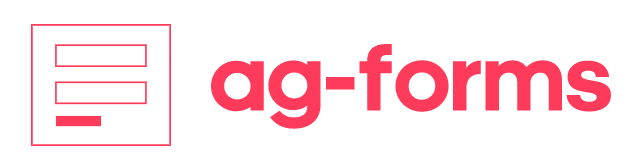

<div align="center">
    <h1>
        
    </h1>
    <h4><b>New website for the Triumph Mayflower Club, launched in March 2018</b></h4>
		⭐ Star us on GitHub — it motivates us a lot!
    <h3>
        <a href="https://www.github.com/andiemmadavies">
            
        </a>
        <a href="https://www.triumphmayflowerclub.com/">
            
        </a>
        <a href="https://www.triumphmayflowerclub.com/news/2018/03/launchofthenewclubwebsite">
            
        </a>
        <a href="https://www.github.com/Stack-in-a-box/triumphmayflowerclub.com/commits/master">
            
        </a>
        <a href="https://www.github.com/Stack-in-a-box/triumphmayflowerclub.com/releases/latest">
            
        </a>
        <a href="#copyright">
            
        </a>
        <a href="https://www.facebook.com/triumphmayflowerclub">
            
        </a>
    </h3>
</div>


WHY?
The [Triumph Mayflower Club](https://www.triumphmayflowerclub.com/) is an organisation dedicated to the preservation of classic 1950s car, the Mayflower, by British car manufacturer Triumph. The club itself formed in 1974 and made its initial, limited foray into the World Wide Web back in [2005](https://legacy.triumphmayflowerclub.com/), and then I ([Andi](https://www.github.com/andiemmadavies), project maintainer) was commissioned in 2017 to create them a new website from scratch when my parents became members. Click [here](https://www.triumphmayflowerclub.com/about) if you’re interested in reading more about the car and the club.

Features

## 🚀&nbsp; Getting started

The `ag-forms` team builds and maintains several packages that helps build Angular Reactive Forms controls and optionally UI view.

<span style="display: inline; font-size: 18px"><b>Option 1: <code>@ag-forms/core</code></b></span> <span style="padding-left: 20px;">:eyes: [Live demo]()</span>

Dynamically builds form controls, subscribes to value changes, etc.

<details>
<summary>Implementation and usage details</summary>

##### Step 1: Install dependencies

_Option 1:_ using <a href="">npm</a>
`npm i @angular/forms @ngx-formly/core @ngx-formly/bootstrap --save`

_Option 2:_ using <a href="">npx</a>
`npx i @angular/forms @ngx-formly/core @ngx-formly/bootstrap --save`

_Option 3:_ <a href="">yarn</a>
`yarn add @angular/forms @ngx-formly/core @ngx-formly/bootstrap`
</br>

##### Step 2: In your app provide access to AgFormService

_Option 1:_ provide in @NgModule()

```ts
import { AgFormService } from '@ag-forms/core';

@NgModule({
  providers: [
    ReactiveFormsModule,
    AgFormService
  ],
  …
})
```

_Option 2:_ provide in @Component()

```ts
import { AgFormService } from '@ag-forms/core';

@Component({
  selector: 'app-hero-list',
  templateUrl: './hero-list.component.html',
  providers: [ AgFormService ]
})
```

##### Step 3: Configure & build form

```ts
import { AgFormService } from '@ag-forms/core';
...

@Component({
  selector: 'app-hero-list',
  templateUrl: './hero-list.component.html',
  providers: [ AgFormService ]
})
export class AppComponent {
  form: FormGroup;
  schema = [{ type: 'input' }, { type: 'email' }];

  constructor(public fs: AgFormService) {
    this.form = this.fs.buildForm(this.schema);
  }
}
```

That's it, the above example will render...

</details>

## 💬 Support

Tell people where they can go to for help. It can be any combination of an issue tracker, a chat room, an email address, etc
Your Name - @your_twitter - email@example.com

## :computer: Contributing

Contributions are welcome! Please see our [Contributing Guide](./CONTRIBUTING.md) for more details. Thanks to all our contributors!

## :page_facing_up: License

This project is licensed under [MIT License](https://license.md/licenses/mit-license/) - see the [`LICENSE.md`](./LICENSE.md) file for details.
