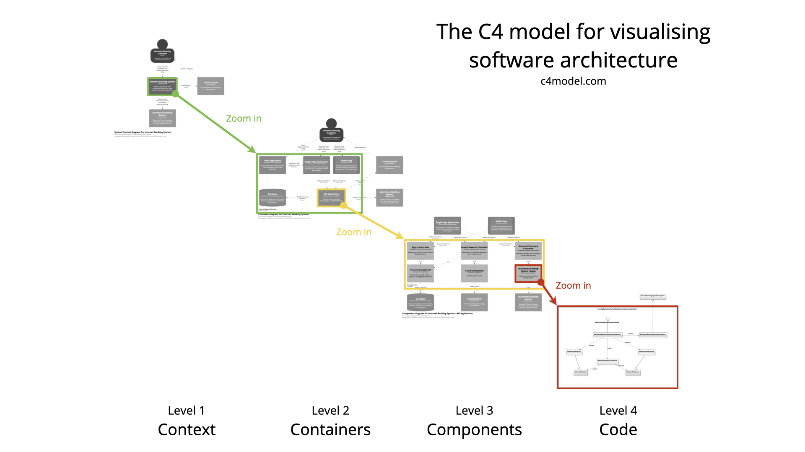

###### ADR-003 / 2022-10-03 / Accepted

# C4 model for visualising software architecture

## Context

We think it's important to communicate how we are planning to build a software system or how an existing software system works. If software development team doesn't think about architecture all sort of problems can appear (inconsistent approaches to solving the same problems, deployment problems, maintenance issues, code that hard to scale, etc).

## Decision

We will document our software system architecture using **[C4 Model](https://c4model.com/)** approach.

To document software architecture we use **[Structurizr](https://structurizr.com/)** that was created by Simon Brown, the author of C4 Model. It's easy and fast tool to use for diagramng.

## Details

"C4 stands for context, containers, components, and code — a set of hierarchical diagrams that used to describe software architecture at different zoom levels, each useful for different audiences. Think of it as Google Maps for code. To create these maps of code, we first need a common set of abstractions to create an ubiquitous language to describe the static structure of a software system. The C4 model considers the static structures of a software system in terms of containers (applications, data stores, microservices, etc), components, and code. It also considers the people who use the software systems that we build." We included all educational materials in the References section bellow. By using the C4 model for software architecture, we capture just enough to communicate to stakeholders and enable team understanding without having to define details that will change as architecture changes.

## References

- [C4 Model site](https://c4model.com/)
- [Simon Brown site (author of C4 Model)](https://simonbrown.je/)
